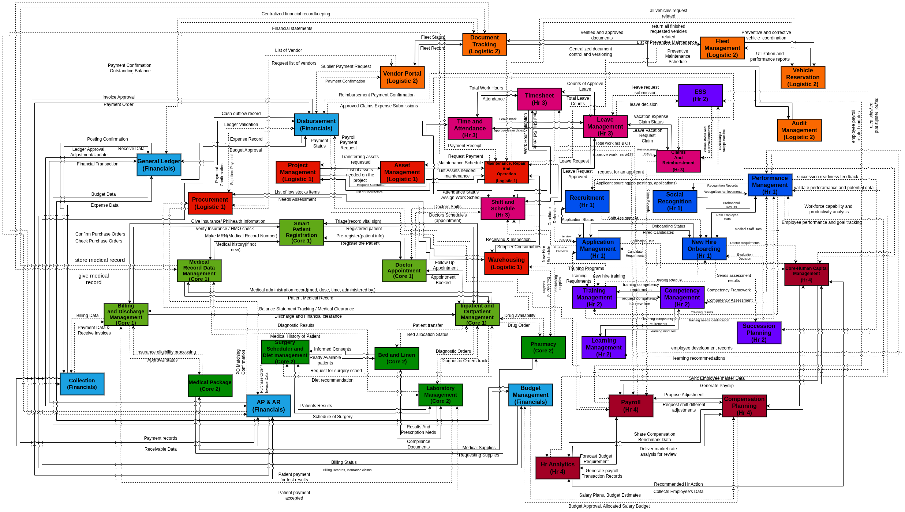

# Hospital Management System (HMS) – School Project

## Project Overview
The Hospital Management System (HMS) is a web-based platform designed to streamline hospital operations. It centralizes patient management, HR, logistics, financial processes, and administrative tasks into one unified system.

---

# Hospital Management Project Team

## Project Leadership

| Role / Position | Name |
|-----------------|------|
| Scrum Master (Project Oversight) | John Christopher V. Atinado |
| Lead Programmer (Technical Lead) | Ken Española |

---

## Core Module Team

| Team | Role / Position | Name |
|------|----------------|------|
| Core1 | Leader / Programmer | John Christopher V. Atinado |
| Core1 | Programmer | Justin Ansilig |
| Core1 | Programmer | Milchor Buctot |
| Core1 | System Analyst | Carl Vincent Pintucan |
| Core1 | Document Specialist | Den Rell Dave John Silva |
| Core2 | Leader / Programmer | Jhon Marwin Batis |
| Core2 | Programmer | John Phaul Baytamo |
| Core2 | Programmer | John Dominic Castro |
| Core2 | System Analyst | Carl Laurence Gaddi |
| Core2 | Document Specialist | Ruby Ann Largo |

---

## HR Module Team

| Team | Role / Position | Name |
|------|----------------|------|
| HR1 | Leader / Programmer | Francis Caibigan |
| HR1 | Programmer | Axel Casamingo |
| HR1 | Programmer | Vincent James Sasi |
| HR1 | System Analyst | Erica Ablaza |
| HR1 | Document Specialist | Lorie Rivero |
| HR2 | Leader / Programmer | Ken Española |
| HR2 | Programmer | TJ Balansag |
| HR2 | Programmer | John Macdarren Benigno |
| HR2 | System Analyst | Mario Jr Candiasan |
| HR2 | Document Specialist | Angelo Generalao |
| HR3 | Leader / Programmer | Dhel Mark A. Gomez |
| HR3 | Programmer | Andrea Jane Villanos |
| HR3 | Programmer | Dexter Garais |
| HR3 | System Analyst | Yllen May Jane C Cortez |
| HR3 | Document Specialist | Luis Jhovan B. Misola |
| HR4 | Leader / Programmer | John Mackie Acuña |
| HR4 | Programmer | Jayson Pinggoy |
| HR4 | Programmer | Stanley Asorio |
| HR4 | System Analyst | Christian Astillo |
| HR4 | Document Specialist | Crystal Mahinay |

---

## Logistics Module Team

### LOGISTICS 1

| Team | Role / Position | Name |
|------|----------------|------|
| Logistics1 | Leader | Fulgencio, Prince Romulo |
| Logistics1 | Programmer | Arevalo, Kieth |
| Logistics1 | Programmer | Paduhilao, Zylven |
| Logistics1 | System Analyst | Calabria, Christian J |
| Logistics1 | Document Specialist | Cuesta, Jemarie |

---

### LOGISTICS 2

| Team | Role / Position | Name |
|------|----------------|------|
| Logistics2 | Leader / Programmer | Baja Raiven Nash |
| Logistics2 | Programmer | Tutor Christian |
| Logistics2 | Programmer | Francis Mercado |
| Logistics2 | System Analyst | Enguerra Yves |
| Logistics2 | Document Specialist | Robles Mark Joseph |

---

## Financials Module Team

| Team | Role / Position | Name |
|------|----------------|------|
| Financials | Leader / Programmer | Mary Joy Turado |
| Financials | Programmer | Junnel Molenilla |
| Financials | Programmer | John Paul Paran |
| Financials | System Analyst | Reynan Peralta |
| Financials | Document Specialist | Jemarieangel Calixtro |

---

## Subsystems & Descriptions

| Subsystem | Description |
|----------|-------------|
| Core1 & Core2 | Clinical and patient care management (patient records, consultations, treatment monitoring) |
| HR1, HR2, HR3, HR4 | Human Resource Management (employee records, attendance, payroll, recruitment, leave management) |
| Logistics1 & Logistics2 | Inventory management, medicine tracking, and supply chain management |
| Financials | Billing system, accounting, and financial reporting |

---

## Technologies Used

- **Backend:** Laravel Framework  
- **Database:** TiDB  
- **Frontend:** Blade Templates  
- **Authentication:** Laravel Breeze  
- **Other Tools:** Composer, NPM, TailwindCSS  

---

## Project Description

This project is developed as a school-based Hospital Management System to demonstrate real-world system architecture using Laravel. The system integrates multiple modules handled by different development teams, including HR, logistics, patient care, and financial management.
---
## LEVEL 1 BPA

---

## Author Notes

This project was created for academic purposes and is intended to simulate a real hospital management platform using modern web development tools.
